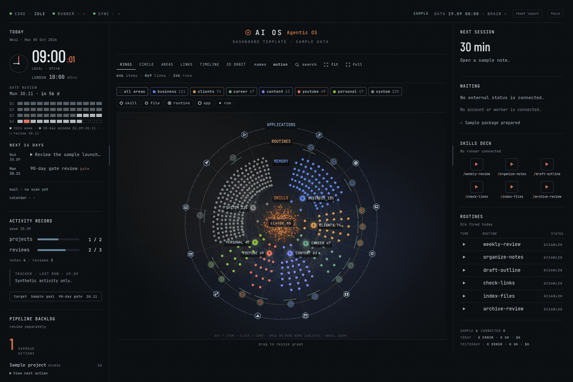

# Set Up Your Own AI OS with the MAPS Framework

The free companion to my video **Turn Claude Code Into Your AI Operating System (4 Layers)**.

Four layers, built in this order, one ready-made prompt per layer, plus a prompt that interviews
you first and a prompt for the dashboard views. Paste a card into Claude Code and it walks you
through building that piece, one step at a time. The same guide as a PDF: `ai-os-maps-guide.pdf`
in this repo.

One thing before you start: the cards are written for Claude Code on your own Claude
subscription. The files they produce are plain markdown, so any LLM can read them later, but if
you run a different agent on a different subscription, check that provider's terms first (see
Card 2).

## MAPS

| Letter | Layer | One line |
|---|---|---|
| **M** | Memory | one map of everything you work on, so Claude can find any fact without you pointing at it |
| **A** | Agent | the same Claude Code on two machines, your laptop and a box that never sleeps |
| **P** | Pulse | routines that run while your laptop is closed |
| **S** | Screen | a dashboard that shows, and never stores, the data it shows |

Build them in exactly that order. The dashboard is the last thing I built, not the first, and
honestly it's about 20 percent of the value. The map and the routines are the rest.

## Three questions before you build anything

1. Can Claude find any fact about your work in two hops, without you pointing at the file?
2. Does anything in your setup run while your laptop is closed?
3. Does your dashboard only show things, or has it quietly become the place where the truth lives?

## Where are you now? The four ladders

| Layer | Level 1 | Level 2 | Level 3 |
|---|---|---|---|
| Memory | a pile of folders, Claude reads 20 files to answer one question | signpost files instead of folders | a generated map, checked every night |
| Agent | Claude Code on your laptop | plus a box that never sleeps | the same folder living on both |
| Pulse | you run things by hand | scheduled tasks on your laptop, they stop when you close it | routines that run without you |
| Screen | a pretty graph you look at | panels that read your real files | a dashboard you press buttons on, and the right machine does the work |

Each card below takes one layer to level 3.

## Card 0: Let Claude interview you first

If you are starting from nothing, don't write the map yourself. Twenty minutes of questions,
one at a time, gives Claude more to work with than an afternoon of you typing folder names.
Run it as many times as you like, on a different topic each time; every session leaves a file
behind.

```text
Before you write anything, interview me. Ask one question at a time and
wait for my answer. Cover, in this order: what my business does and for
whom, the five things I do every week, who I owe something to right now
and what, where my files and notes actually live today, and what I keep
forgetting. Push back when an answer is vague. Save every question and
answer as we go to interviews/<today>-<topic>.md. When I say "stop",
write the first draft of my memory map from the answers (the prompt in
Card 1), and list what you still do not know.
```

## Card 1: Memory

By memory I don't mean a chat history. I mean whether Claude can find the right file without
you. At the top sits one short file (mine is 40 lines) that holds no facts at all, it only says
where things live, one line per area of your work. Each line points to a signpost file for that
area, and that file points to the real documents. So any document is two steps from the top.
The signpost idea comes from Jay E's Agentic OS video; the generated map and the nightly check
are what I added.

Two rules keep it honest:

- **Every fact has exactly one home.** Nothing gets written twice.
- **A small check runs every night** and flags any signpost that points to a file that has
  moved, so the map can't quietly go stale.

**Why it pays, measured.** Same question, two fresh Claude Code sessions in my workspace:
"Which words am I never allowed to use in a LinkedIn post, and where is that written down?"
Both found the right file. Without the map: 1 min 2 s, 27.7k tokens of reading and writing
(the Messages line of `/context`). With the map: 30 s, 16.8k tokens, about 40 percent less. On
a second run the reading gap was smaller, but the map was still about twice as fast.

```text
Scan my project folders and draft a memory map: one master signpost file
under 60 lines listing my areas of work, and one signpost file per area
under 80 lines, with these fixed sections in this order: Projects, State,
Skills, Memory, Routines, Not here. Every line is
"- [name](absolute path): one-line note". For now list names and paths,
leave the notes blank for me to fill in. Every fact gets exactly one home,
never two. Then write a checker that confirms every listed path still
exists, every signpost file has all six sections in the right order, and
flags any project folder that shows up in neither an area file nor an
archive list. I want to run the checker every night, so make it a single
command that exits non-zero on any problem.
```

## Card 2: Agent

The same Claude Code, on two machines: your laptop, and a small computer you rent in the cloud
that never sleeps (mine is a Hostinger VPS). Both hold a copy of the same folder, and it syncs
itself every five minutes in both directions, over git, so whichever machine Claude runs on has
the same map and the same skills.

Two things matter, because this server works while you're asleep and nobody is watching it:

- **Keep it off the public internet.** I use Tailscale (free), which puts my laptop, my phone
  and the server on their own private network. No public address, nothing to knock on.
- **Limit the Claude that runs there, on purpose.** One settings file blocks every tool that
  could send, share or delete. It can write an email for me, it cannot send one. The worst it
  can do is leave me a draft.

**On terms.** Anthropic's rules don't let you use your Claude subscription through someone
else's app or agent harness. What you can do is run Claude Code itself on the server, signed in
with your own account through the official setup-token flow. That's what I do, and it costs
nothing extra on top of the subscription. If you're on another provider, their terms are
different, so check them before you copy this.

```text
I want to run you unattended on a second, always-on machine, under my
existing subscription rather than a copied session or a third-party
tool. Walk me through it one step at a time, and confirm each step
works before moving to the next:
1. create a low-privilege user for you to run as, no admin rights
2. join a private network layer first (for example Tailscale), verify
   a second login works over it, then lock the public firewall down to
   deny everything inbound
3. run the official setup-token flow so you can authenticate here
   without a browser
4. clone my repo, then write a small script that pulls, commits and
   pushes on a schedule, so this machine and my everyday one share one
   memory
5. give the copy of you on this machine a settings profile that denies
   every tool that can send, share or delete, so the most you can do
   is leave me a draft; then prove it by trying to send a test email
Stop and ask before opening any port, and never install a second
runtime or a second subscription to do this.
```

**Optional, the phone.** I send a voice note to a Telegram bot on the server, it turns my voice
into text, works out what I'm asking for, and Claude answers in the same chat.

```text
On the always-on machine, build me a small Telegram bot that I can talk
to by voice or text. It answers ONLY my own chat ID and ignores everyone
else. Voice notes are transcribed to text first. Each message is routed
to one of: a question about my files, add a note, or show today's plan,
and Claude answers in the same chat using the restricted profile from
step 5, never a broader one. Log every message and reply to a dated
file in my repo. Ask me before adding any other route.
```

## Card 3: Pulse

One file lists every routine: a name, a schedule, which machine runs it, what it runs, and a
turn and time limit. A scheduler on each machine checks that list every five minutes and runs
whatever is due. Every run leaves a record, which is what the dashboard reads later, and a cap
stops a routine that keeps failing from burning through your whole month overnight.

Start with the one I use most, the morning digest: it lands in my chat before I'm awake, what
happened overnight, what's due today, who's waiting on me.

```text
Set up a routines system for scheduled, unattended work:
- a registry file listing each routine's name, schedule, which
  machine runs it, the prompt or skill it runs, model, effort,
  allowed tools, a max-turn limit, a timeout, and where the output
  goes
- one runner script both machines share, fired by a scheduler every
  five minutes, that reads the registry and runs whatever is due
- every run appends one log line: time, name, model, turns, cost,
  status
- two caps read from that same log: a daily run ceiling and a short
  rolling-window ceiling, so one misfiring routine cannot burn my
  whole quota
Start with one routine: a morning digest that tells me what happened
overnight, what is due today and who is waiting on me, delivered
wherever I already read messages.
```

## Card 4: Screen

The rule I'd keep even if you never build a dashboard: **show, don't store.** Every panel is read
from a file that something else already wrote. My laptop builds the panels about my week,
because that's where my tracker lives; the server builds the routines board, because that's where
the routines run; the brain is rebuilt every night from my notes. The page itself stores
nothing, so it's safe to look at from my phone on holiday, and if the dashboard died tomorrow I'd
lose nothing, every fact still sits in a file I own.

```text
Build me a tiny local dashboard, standard library only, no framework,
no build step. It should:
- serve one HTML page plus a handful of JSON files under a data
  folder, and only ever read that folder, never write to it
- show each panel's own timestamp, and mark it stale rather than
  hiding an old value
- bind to a loopback address or a private network only, never a
  public port
- add no cookies, no login, no third-party JavaScript
Show me the route list before writing any code, and refuse any route
I have not asked for.
```

**Level 3, the buttons.** On my dashboard I can press play on a routine and the right machine
runs it. It still doesn't store anything: the button only drops a request file into a queue.

```text
Add one action to my dashboard: a play button next to each routine in
the registry. Pressing it writes a small request file (routine name,
time, requested-by) into a queue folder, and nothing else. The runner
from my routines system picks up queued requests on its next pass, but
only on the machine the registry assigns to that routine, runs them
under the same caps, and removes the request once the run is logged.
The dashboard itself still never writes to its data folder.
```

## Card 5: The brain views (rings, circle, areas, links, timeline, 3D orbit)

The centre of my dashboard is a graph of my real files. It is built from one JSON file that a
nightly routine writes by walking the map from Card 1: every file is a node, every signpost or
reference is a link. The page then draws that one file six ways. This is the spec I built mine
from; hand it to Claude Code after Card 4 exists. Build it last. It's the part people click on,
not the part that saves you time.

```text
Add a "brain" panel to my dashboard. Input: data/brain.json, written by
a nightly script that walks my memory map and my notes, with
  nodes: [{id, kind, label, area, layer, path, note, changed}]
    kind in {root, area, project, skill, memory, note, routine, run, app}
    layer in {core, memory, skills, routines, apps, runs}
  links: [{s, t}]   (source id, target id)
Draw it on one canvas with a vendored d3 (no CDN), dark theme, and
six views of the SAME nodes behind a toggle:
  rings    - concentric rings by layer, the root file in the centre
  circle   - all nodes on one ring, links across the middle
  areas    - one cluster per area, the root in the middle
  links    - a force layout so relationships are visible
  timeline - top half: routine runs by day; bottom: files by last change
  3d orbit - a slow 2.5D projection that rotates on its own
Colour by area, shape by kind, dot size by number of links. A legend
that isolates one area or one kind. A "names" toggle for labels, a
"motion" toggle for the idle animation, "fit" and "full screen".
Hover dims everything except the node and its links. Click opens a
card with the label, note, path and buttons: open (the file text,
read through the dashboard's read-only route), copy path, fly to
(animate the camera to the node). Search over label, path and note,
with fly-to on the result. Keep every animation under 60 fps budget on
a laptop and give me one constant block at the top of the script
where every speed and count lives, so tuning is one number.
```

## Seven rules carried into every layer

- Claude never marks a task done, only you tick it
- Append to store files, never rewrite them whole
- Deterministic code runs before any model call
- Show, don't store: a dashboard reads, it never owns the truth
- Update the signpost the same turn a file moves
- Nothing gets deleted: archive it, park it, keep an undo
- Plans and specs live in the repo, not in chat

## What I am deliberately not building

- No dashboard first: the views come last, on top of files you can read without them
- No second agent app bolted onto a different subscription
- No folder-sync tool doing the job git already does
- No public dashboard with a login page, private network only
- Nothing on the server that can send, share or delete on its own

## What it costs

On top of the Claude subscription I already pay for: the VPS (mine is a small Hostinger plan,
about $140 for two years on a Black Friday deal, so roughly $6 a month) and a few dollars a month
of voice transcription. That's it. Check the live price before you buy; plans and deals change.

## Ready-made dashboard interfaces

[](https://www.patreon.com/pavrus/posts/start-here-ai-os-170886453)

Want the ready-made dashboard interfaces? They are available through the
[paid Patreon Builder membership ($15/month)](https://www.patreon.com/pavrus/posts/start-here-ai-os-170886453).
The MAPS guide remains free.

---

Made by Pav, Automation Orbit. More on YouTube: https://www.youtube.com/@pavrusovs
